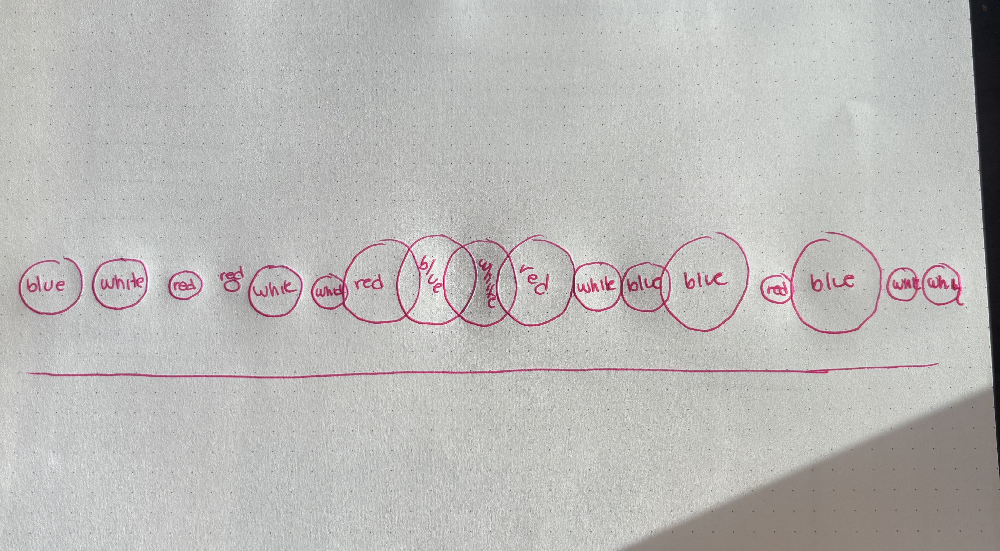
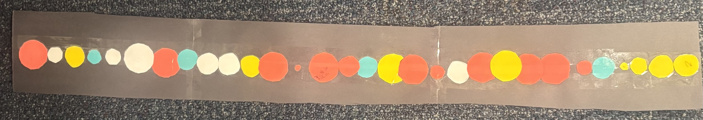

[My GitHub Repository](https://github.com/baranickkyra/ENVS-193DS_homework-03)

```{r}
#| message: false
#| warning: false
library(tidyverse)
library(here)
library(janitor)
library(readxl)

salinity <- read.csv(here("data","salinity-pickleweed.csv"))
Kyra_data <- read.csv(here("data","personal_data.csv"))

```

# Problem 1

### a.

Two appropriate tests for evaluating the strength of the relationship between soil salinity (mS/cm) and pickleweed biomass (g) are Pearsons correlation and spearmans rank correlation . Pearson’s correlation measures the strength of a linear relationship and assumes normality and equal variance, while Spearman’s correlation uses the ranked values and does not require normality, making it more appropriate for skewed or nonlinear patterns. Both treat salinity and biomass as continuous variables but differ in their assumptions and sensitivity to outliers.

### b.

```{r}
library(ggplot2)
library(dplyr)

# Fit the linear model
lm_fit <- lm(pickleweed ~ salinity_mS_cm, data = salinity)

# Create dataframe of fitted values + confidence intervals
pred_df <- predict(
  lm_fit,
  newdata = data.frame(salinity_mS_cm = salinity$salinity_mS_cm),
  interval = "confidence"
) %>%
  as.data.frame() %>%
  mutate(salinity_mS_cm = salinity$salinity_mS_cm)

# Plot
ggplot() +
  geom_point(
    data = salinity,
    aes(x = salinity_mS_cm, y = pickleweed),
    color = "darkgreen",
    size = 3,
    alpha = 0.7
  ) +
  geom_ribbon(
    data = pred_df,
    aes(x = salinity_mS_cm, ymin = lwr, ymax = upr),
    fill = "orange",
    alpha = 0.25
  ) +
  geom_line(
    data = pred_df,
    aes(x = salinity_mS_cm, y = fit),
    color = "orange",
    linewidth = 1.2
  ) +
  labs(
    x = "Soil salinity (mS/cm)",
    y = "Pickleweed biomass (g)",
    title = "Relationship between soil salinity and pickleweed biomass"
  ) +
  theme_classic()


```

### c.

### Checking Assuptions

```{r}
# Fit the linear regression model
lm_fit <- lm(pickleweed ~ salinity_mS_cm, data = salinity)

# Produce the four diagnostic plots
par(mfrow = c(2, 2))   # optional: shows all 4 plots in one window
plot(lm_fit)

```

Residuals vs Fitted : This plot helped evaluate linearity and constant variance. The points were scattered without a strong curve, and the spread of residuals stayed fairly even across fitted values. That pattern suggests the relationship between salinity and biomass is approximately linear and that variance is not dramatically increasing or decreasing.

Normal QQ Plot : This plot checked normality of residuals. Most points fell close to the diagonal line, with only mild deviations at the tails. That pattern indicates that the residuals are reasonably close to normally distributed, which is sufficient for Pearson’s correlation.

Scale Location Plot : This plot provided another view of homoscedasticity. The red line was about flat, and the spread of points around it did not show a funnel shape. That consistency supports the assumption of equal variance across levels of salinity.

Residuals vs Leverage : This plot helped identify influential points. No observations were far outside the Cook’s distance , and leverage values were moderate. This indicates that no single point was disproportionately influencing the linear relationship.

Pearson’s correlation assumes, linearity between salinity and biomass, normality of residuals. Overall the assumptions were met.

### Running test

```{r}
cor.test(
  ~ salinity_mS_cm + pickleweed,
  data = salinity,
  method = "pearson"
)

```

### d.

To evaluate the strength of the relationship between pickleweed biomass and soil salinity, I used a Pearsons correlation because both variables are continuous and my diagnostic plots indicated that the assumptions of linearity and approximate normality were reasonably met. There is a statistically significant moderately positive correlation between soil salinity and CA pickle weed biomass(g), meaning that biomass tends to increase as soil salinity increases. (Pearson's r = 0.53, t(21) = 2.90, p = .009, α = .05)

### e.

The analysis shows that pickleweed biomass increases as soil salinity increases, and this relationship is statistically reliable (r = 0.53, p = .009). This means areas of the slough with higher salinity are more likely to support stronger pickleweed growth. For planting decisions, we should prioritize high salinity zones if our goal is to maximize biomass.

### f.

```{r}
cor.test(
  ~ salinity_mS_cm + pickleweed,
  data = salinity,
  method = "spearman"
)

```

There is a statistically significant moderately positive monotonic relationship between soil salinity and California pickleweed biomass (g), meaning that biomass tends to increase as salinity increases even when the data are ranked. (Spearman’s ρ = 0.59, S = 824, p = .003, α = .05)

Pearson’s and Spearman’s correlations led to the same conclusion about the relationship between salinity and pickleweed biomass: both tests detected a positive and statistically significant association. Pearson measured the strength of the linear relationship (r = 0.53, p = .009), while Spearman measured the strength of the monotonic relationship, which is less sensitive to normality and outliers. Because both tests agreed, the interpretation remains the same meaning biomass increases as soil salinity increases

# Problem 2

### a.

```{r}
ggplot(Kyra_data, # making a ggplot using the data from Proj1
       aes(x = Weekend.or.Weekday,   # using weekend or weekday as the categorical xaxis
           y = Pickups, # using pickups data for the y axis
           fill = Weekend.or.Weekday)) + # filling with different colors for weekendand weekday
  geom_boxplot(alpha = 0.2) + # adjusting the transparency
  geom_jitter(width = 0.2, # giving the points a slight horizontal jitter
              height = 0, # NO vertical jitter
              alpha = 0.8, # making points semi-transparent for readability
              shape = 21) + # picking a different shape
  labs(
    title = "Phone Pickup Count: Weekends vs Weekdays", # creating the title ofthe graph
    subtitle = "Most recent observation: February 18, 2026",
    x = "Day Type", # labeling the x axis
    y = "Pickup Count" # labeling the y axis
  ) +
  scale_fill_manual(values = c( # filling with colors otherthen the default
    "weekday" = "red",
    "weekend" = "purple"
  )) +
  
  theme_classic() + # changed the theme form the default
  guides(fill = "none") # removing the legend

```

```{r}
ggplot(Kyra_data, # creating a plot using ggplot 
       aes(x = `min.of.sleep.the.night.before`, # using min of sleep as the x axis 
           y = Pickups)) + # using pickups as the y-axis
  
  geom_point(color = "#1B9E77",   # nondefault green 
             size = 3 # adjusting the size for visibilty 
             ) + #
  
  geom_smooth(method = "lm",
              se = TRUE,           # shows confidence band
              color = "#D95F02",   # non-default orange
              linewidth = 1.2) +   # widening the line just to do soem extra messing around with the visual
  
  labs(
    title = "Phone Pickups vs. Minutes of Sleep", # adding a title
    subtitle = "Most recent observation: February 18, 2026", # putting my most recent obs as the subtitle 
    x = "Minutes of sleep the night before (min)", # labeling my x-axis
    y = "Phone pickup count (number of pickups)"    # labeling my y-axis
  ) +

  theme_classic() + # changing the theme form the gghplot default 

  theme(
    panel.grid = element_blank(),        # removes all gridlines
    panel.background = element_blank(),  # removes grey panel background
    plot.background = element_blank(),   # removes outer plot background
    axis.line = element_line(color = "black"),  # keeps clean black axis lines
    axis.ticks = element_line(color = "black")  # keeps ticks visible and clean
  )

```

### b.

FIGURE 1: The x-axis (Day Type) shows whether the day is a weekday or weekend, and the y-axis (Pickup Count) shows the number of phone pickups. The red box represents weekdays and the purple box represents weekends. Dots show individual daily observations, pink being weekdays and purple for weekends. The black line inside each box is the median, the box edges show the interquartile range (middle 50% of values), and the vertical lines (whiskers) show the range of non-outlier values. The subtitle indicates the most recent observation date (February 18, 2026).

FIGURE 2 : The x-axis (Minutes of sleep the night before) shows sleep duration in minutes, and the y-axis (Phone pickup count) shows the number of daily phone pickups. Green dots represent individual daily observations. The red line shows the fitted linear trend between sleep and phone pickups, and the gray shaded band represents the confidence interval around the trend line. The subtitle indicates the most recent observation date (February 18, 2026).

# Problem 3

### a.

My affective visualization will use a timeline of overlapping circles of cutout construction paper to represent my daily boredom levels and phone pickups. Each circle’s size will reflect my boredom on a scale of 1–5, with lower boredom shown as larger circles and higher boredom as smaller ones (starting at 1=1inch and moving down inches for each value 2-=0.8 inches, 3=.06 inches, 4 = .03 inches and 5 = .02 inches ). The circles will be colored along a heat gradient, shifting from cool blues for fewer phone pickups to warm reds for more frequent pickups. 100-125 will be blue then 125-150 will be white 150-175 will be yellow and 200+ will be red) As the circles overlap, they will create visually dense or chaotic areas that express how stressful or repetitive certain days felt.

### b.



### c.



### d.

My piece visualizes my daily boredom levels and phone pickups through a timeline of overlapping construction‑paper circles that vary in size and color. I was influenced by the climate‑change heat‑gradient graphic we studied in class, which showed how a simple shift in color can communicate intensity and emotion. I will also invite some chaos into my project with the overlapping circles indicating stressful time in this month. I will create this by cutting paper circles and making then equidistant apart allowing for some overlap when large 1 boredom rank circles appear right next to each other.

### e.

[My slides](https://www.canva.com/design/DAHDDJ39j6Y/3cjUokWinVR7a40nIoQywg/edit)

# Problem 4

### a.

This test uses a Spearmans correlation test to analyze contamination of PFAs in groundwater in Hutuo China. The response variables are the individual PFAS concentrations measured in groundwater samples (PFOA, PFNA, PFHxA, etc). These are the outcomes being compared against each other in the correlation analysis. The predictor variable is the site (1-4) that the sample came from. We are also comparing the concentration of another PFAS compound in the same groundwater samples in the Spearmans correlation.

### b.

The table presents the correlation results in a clear and straightforward grid, with PFAS compounds listed along both axes in a logical order. The authors include significance markers (\* and \*\*) that make it easy to identify which correlations are statistically meaningful at the .05 and .01 levels respectively. However, the table does not show any underlying data distributions or sample variability, so the reader cannot assess how strongly skewed or clustered the concentrations are.

### c.

The table has minimal decorative elements, resulting in a high data:ink ratio. The authors avoid bolding or color coding, which keeps the table clean but also makes it harder to quickly spot the strongest correlations without scanning each cell. The use of asterisks for significance is subtle and does not distract from the numerical values.

### d.

To make the table easier to read, I would add light shading or color gradients to show which correlations are stronger or weaker. This would help readers quickly spot PFAS compounds that behave similarly. I would also add a short note with confidence intervals or sample size information so the reader understands how reliable each value is ( just form looking at the table not the whole study). Another option would be to include a correlation heatmap, with PFAS on both axes and color showing the strength of each correlation, which would make patterns much easier to see at a glance.
